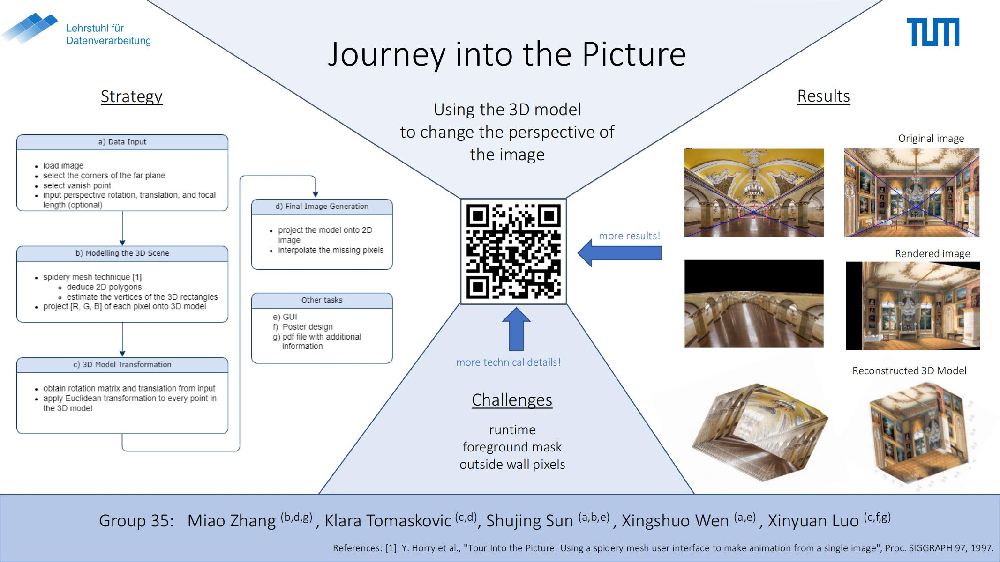
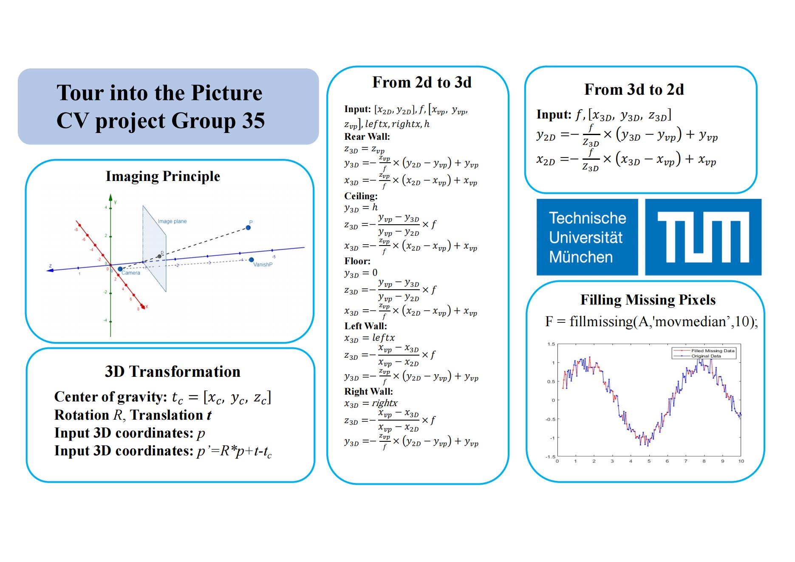
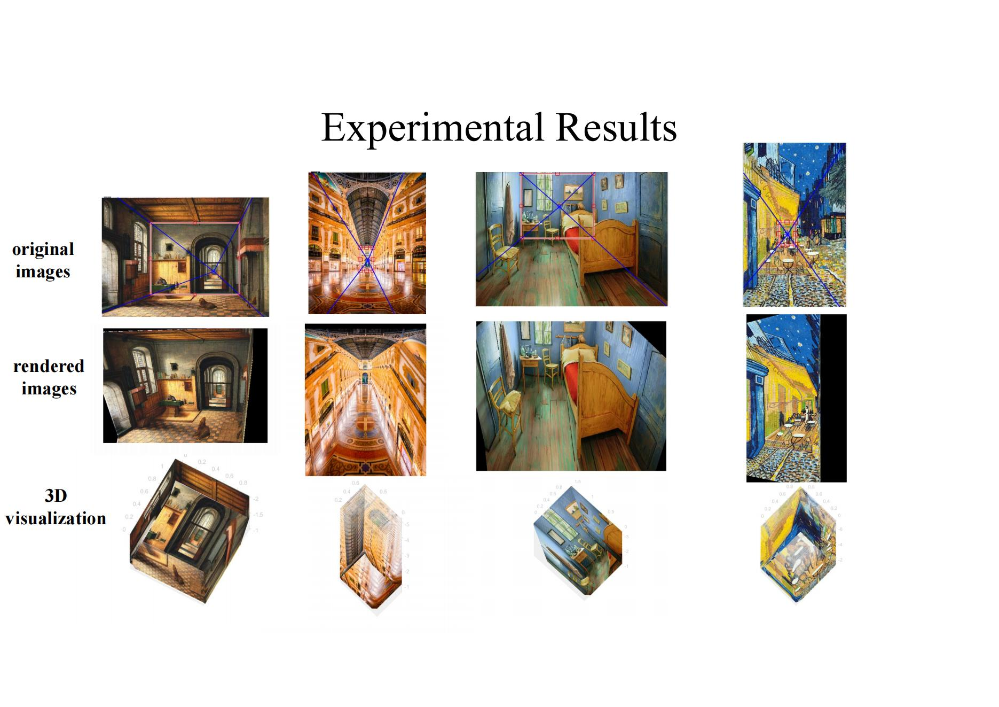

# Tour-into-the-Picture-by-Matlab
TUM [EI70110] Computer Vision  22SS final project, based on the paper:

Horry, Youichi, Ken-Ichi Anjyo, and Kiyoshi Arai. "Tour into the picture: using a spidery mesh interface to make animation from a single image." Proceedings of the 24th annual conference on Computer graphics and interactive techniques. 1997. 
## Usage 
Used Toolboxes: Matlab Computer Vision Toolbox, Image Processing Toolbox
 
Instructions:
-run the main.m function to open the program
-press the load image button to select an image to transform
-use your mouse to set the rear panel and the vanishing point
-press the draw line button to create the spidery mesh
- press 'reset' button if the selected points are not accurate
- press 'set' button to submit the inputs
-input rotation and translation values
- press 'set value' button to get the transformed image and the 3d interactive model of the scene

## Method
Introduction:

Details:

## Experimental Results

## Reference 
partially based on a C++ implementation:
http://www.mizuno.org/gl/tip/#req

